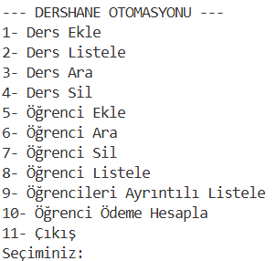

# Dershane Otomasyon Sistemi (Java Console Application)

Bu proje, bir dershanedeki öğrencilerin kaydını tutan, ders seçimlerini yöneten ve kampanya kurallarına göre aylık ödeme tutarlarını hesaplayan bir Java konsol uygulamasıdır. Nesne Yönelimli Programlama (OOP) prensipleri kullanılarak geliştirilmiştir.

## 🚀 Özellikler

* **Dosya İşlemleri (File I/O):** Öğrenci ve ders verileri `.txt` dosyalarından okunur ve güncellemeler dosyalara geri yazılır.
* **Dinamik Veri Yönetimi:** `ArrayList` yapısı kullanılarak dinamik olarak öğrenci ve ders eklenebilir/silinebilir.
* **İlişkisel Veri Kontrolü:** Bir ders silinmek istendiğinde, o dersi alan öğrenci olup olmadığı kontrol edilir.
* **Ödeme Algoritması:** Alınan ders sayısına göre (2 ders %5, 3 ders %15 vb.) otomatik indirim ve ücret hesaplaması yapar.

## 🛠️ Kullanılan Teknolojiler

* Java (JDK 8+)
* Nesne Yönelimli Programlama (OOP)
* Dosya Okuma/Yazma (BufferedReader/BufferedWriter)

## screenShot

## 📦 Kurulum ve Çalıştırma

1.  Projeyi klonlayın:
    ```bash
    git clone [https://github.com/mustafaatunc/Dershane-Otomasyonu.git](https://github.com/mustafaatunc/Dershane-Otomasyonu.git)
    ```
2.  Proje dizinine gidin ve derleyin:
    ```bash
    javac Anasayfa.java Ders.java Ogrenci.java
    ```
3.  Uygulamayı başlatın:
    ```bash
    java Anasayfa
    ```