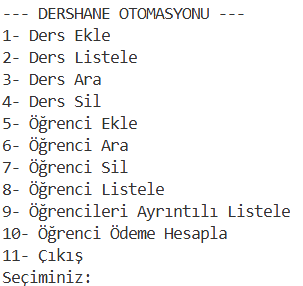

# Classroom Automation System (Java Console Application)

This project is a Java console application developed using Object-Oriented Programming (OOP) principles. It keeps track of student registrations, manages course selections, and calculates monthly payment amounts based on campaign rules within a private educational institution (dershane).

## 🚀 Features

* **File Operations (File I/O):** Student and course data are read from `.txt` files, and updates are written back to the files.
* **Dynamic Data Management:** Students and courses can be dynamically added or deleted using the `ArrayList` structure.
* **Relational Data Control:** When attempting to delete a course, the system checks whether there are any students currently enrolled in that course.
* **Payment Algorithm:** Automatically calculates discounts and fees based on the number of courses taken (e.g., 2 courses = 5% discount, 3 courses = 15% discount, etc.).

## 🛠️ Technologies Used

* Java (JDK 8+)
* Object-Oriented Programming (OOP)
* File Reading/Writing (BufferedReader/BufferedWriter)

## screenShot


## 📦 Installation and Execution

1. Clone the project:
    ```bash
    git clone [https://github.com/mustafaatunc/Dershane-Otomasyonu.git](https://github.com/mustafaatunc/Dershane-Otomasyonu.git)
    ```
2. Navigate to the project directory and compile:
    ```bash
    javac Anasayfa.java Ders.java Ogrenci.java
    ```
3. Launch the application:
    ```bash
    java Anasayfa
    ```
